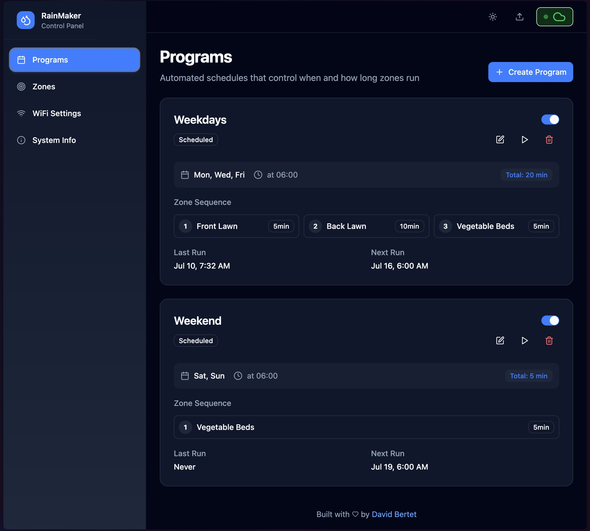

# RainMaker: ESP32 Sprinkler Controller

<div align="center">
  
  
  
</div><br/>

A modern, open-source sprinkler controller for ESP32. Easily manage irrigation zones and schedules with a sleek web interface and robust backend.

## 🌟 Features

- Define irrigation zones and custom watering programs
- WiFi connection flow for easy setup
- OTA (Over-the-Air) updates for future maintenance
- CLI tool for easy installation and updates
- Fully mobile-friendly interface for use on any device

Try the [web sample](https://davidbertet.github.io/RainMaker/) to see what it is capable of!

[](https://davidbertet.github.io/RainMaker/)

## ⚙️ Requirements

- ESP32 development board
- PlatformIO (for backend build)
- Node.js & npm (for frontend build)

## 🚀 Quick Start

1. **Clone the repository**
   ```shell
   git clone https://github.com/davidbertet/RainMaker.git
   cd RainMaker
   ```
2. **Install on your ESP32**

   ```shell
   ./install.sh
   ```

   And follow the instructions

   

3. **Update over the air**
   ```shell
   ./install.sh --ota <IP>
   ```

## 📝 CLI Usage

```shell
Usage: ./install.sh [OPTIONS]

Options:
  -o, --ota <IP>              Set OTA IP address for over-the-air updates
  -p, --upload-password <PWD> Set upload password for authentication
  -y, --yes                   Auto-confirm all prompts (non-interactive mode)
  -f, --frontend-only         Build/deploy frontend only
  -b, --backend-only          Build/deploy backend only
  -h, --help                  Show this help message
```

## 🛠️ Tech Stack

- Lightweight Svelte frontend for fast performance
- ESP-IDF backend with static file serving
- Websocket interface for real-time updates

## 📁 Folder Architecture

```
RainMaker/
├── frontend/    # Svelte web application
├── backend/     # ESP-IDF backend code
├── cli/         # CLI tool for install/update
└── assets/      # Images and media for docs
```

## 📚 Documentation & Support

- [Issues](https://github.com/davidbertet/RainMaker/issues)
- [Sample Web UI](https://davidbertet.github.io/RainMaker/)

## 📝 License

This project is licensed under the MIT License.
